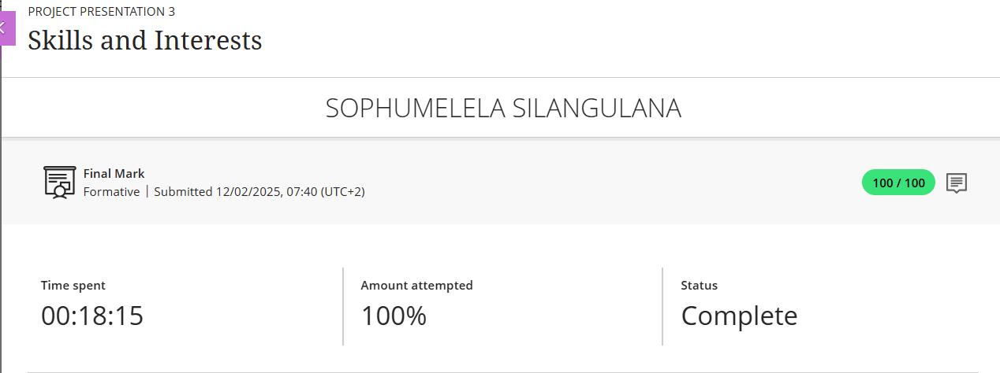
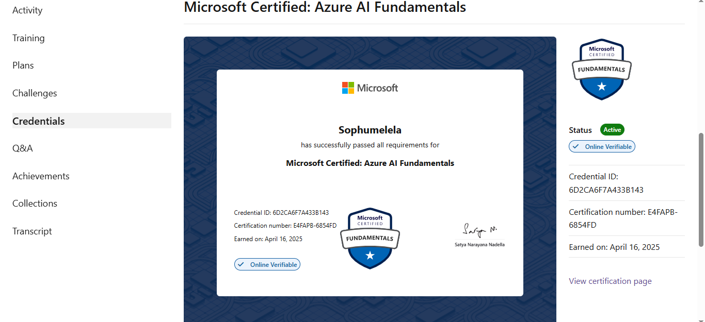
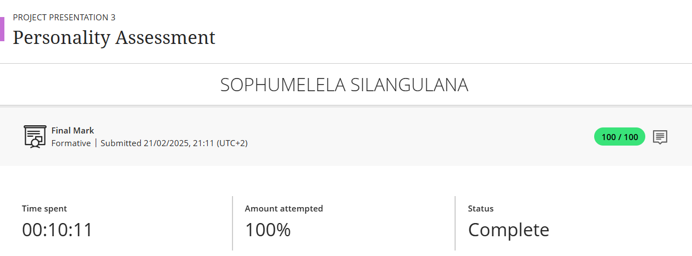
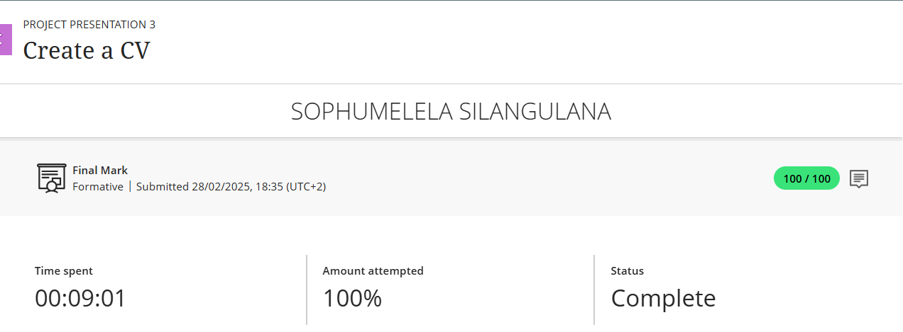
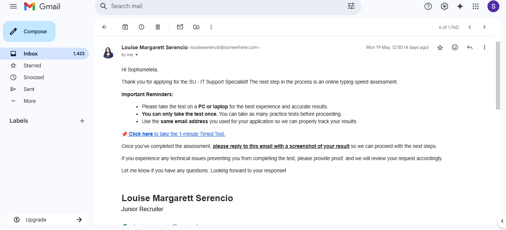

# Digital-Portfolio

My name is Sophumelela Silangulana, and I am currently a 3rd year student at Cape Peninsula University of Technology pursuing a field in ICT (Diploma in Communication Networks).With a strong foundation in networking protocols along with security tools and Application development, and also working on projects such as Network Management, network security and updating network infrastructure. These experiences have allowed me to develop skills in Networking and Security.
 

---

## Career Counselling

### Evidence
- Attended career counselling session with an advisor.
- Explored career paths in Information Technology, including Networking and Software Development.
- Gained insights on how to align my skills and education with market needs.

###  Reflection
- **Situation**: I was uncertain about the specific IT career path I should pursue. 
- **Task**: Attend career counselling to clarify my career direction.  
- **Action**: I discussed my academic background and interests with a counsellor to explore various IT-related options.  
- **Result**: I decided to focus on Networking and Systems Administration while continuing to grow in development and cloud computing.
---
## Skills and Interests

### Evidence
 

- Microsoft Office Suite (Word, Excel, Access, PowerPoint)
- Java, HTML, CSS
- Networking concepts & Cisco device configuration
- Cloud fundamentals and Azure AI-900 certification
- Figma (UX Design)
- Basic Linux and network administration

### Reflection 
- **Situation**: I needed to evaluate my technical and soft skills.  
- **Task**: Compile and reflect on all skills gained from academic and personal development.  
- **Action**: Reviewed coursework, certifications, and personal learning experiences. 
- **Result**: Identified my strongest areas in networking, problem-solving, and front-end development, which align with my career goals.
---
## Personality Assessment

### Evidence

### Reflection 
- **Situation**: I wanted to understand how my personality influences my career path. 
- **Task**: Take a personality test and assess results.  
- **Action**: Completed a detailed personality profile and reflected on the insights. 
- **Result**: Realized that my structured and analytical nature suits IT roles such as network admin and systems support.
---
## Create a CV

### Evidence

 

 [ View My CV ](./CV%20OF%20Sophumelela%20Silangulana.pdf)

### Reflection – STAR Technique
- **Situation**: I needed to develop a professional CV.  
- **Task**: Create a clear and effective document.  
- **Action**: Drafted, revised, and formatted a detailed CV.  
- **Result**: Used for job/internship applications with positive results.

---

## CV Submission

### Evidence

### Reflection
- **Situation**: I was searching for industry exposure.  
- **Task**: Apply using my CV.  
- **Action**: Sent targeted applications with tailored CVs.  
- **Result**: Received responses and invitations to interviews.

---

## Repository Info

**Created by:** Sophumelela Silangulana 

**Cell no:** 065 626 0271

**Email:** silangulanas@gmail.com

**LinkedIn:** https://www.linkedin.com/in/sophumelela-silangulana-086799234/
